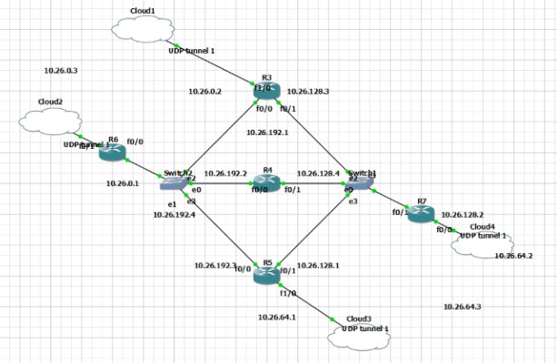
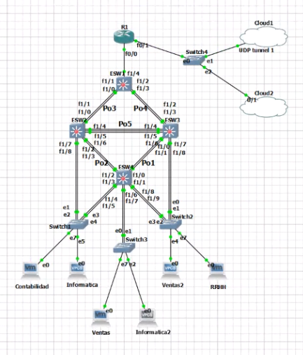
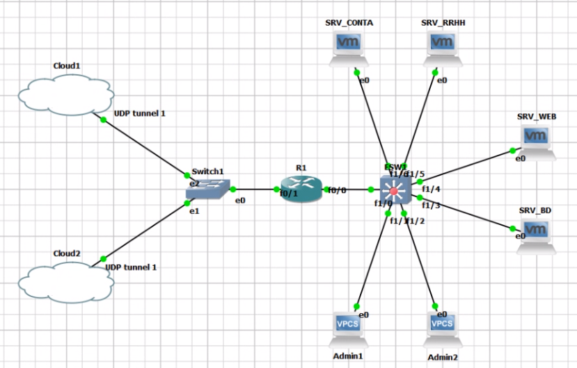

# **Manual de Construcción y Configuración**

## **Contenido**   
- [Topología 1](#idTopo1)
- [Topología 2](#idTopo2)
- [Topología 3](#idTopo3)
- [Configuración VPN ](#idVPN)


### Tabla de configuraciones de la nube
| TOPOLOGIA |     LOCAL PORT     	|  REMOTE HOST	|   REMOTE PORT  	|
|:-------:	|:-------------------:	|:-----------:	|:---------------:	|
|    1   	|         3525      	|    10.8.0.4  	|       5671     	|
|    2   	|         3530      	|    10.8.0.4   |       5676    	| 
|    3   	|         3550      	|    10.8.0.2   |       3223    	| 
|    4   	|         3555      	|    10.8.0.2   |       3228    	| 


## Topología 1<a name="idTopo1"></a>

<div align="center">
    
    <p align="center">Diseño Topología 1</p>
</div>

| DIRECCIÓN DE RED | PRIMERA ASIGNABLE | ULTIMA ASIGNABLE | BROADCAST       | MASCARA         |
|------------------|-------------------|------------------|-----------------|-----------------|
| 10.26.0.0        | 10.26.0.1         | 10.26.63.254     | 10.26.63.255    | 255.255.192.0   |
| 10.26.64.0       | 10.26.64.1        | 10.26.127.254    | 10.26.127.255   | 255.255.192.0   |
| 10.26.128.0      | 10.26.128.1       | 10.26.191.254    | 10.26.191.255   | 255.255.192.0   |
| 10.26.192.0      | 10.26.192.1       | 10.26.255.254    | 10.26.255.254   | 255.255.192.0   |


``` bash
    ========= R6 ============
conf t
int fa0/1
ip address 10.26.0.1 255.255.192.0
no shutdown
end
write

conf t
int fa0/0
ip address 10.26.192.4 255.255.192.0
no shutdown
end
write

conf t 
router rip 
version 2 
network 10.26.0.0
exit

router rip 
version 2
network 10.26.192.0
exit


int fa0/0
vrrp 192 ip 10.26.192.5 
vrrp 192 priority 250
vrrp 192 preempt 
exit 


========= R3 ============
conf t
int fa1/0
ip address 10.26.0.2 255.255.192.0
no shutdown
end
write

conf t
int fa0/0
ip address 10.26.192.1 255.255.192.0
no shutdown
end
write

conf t
int fa0/1
ip address 10.26.128.3 255.255.192.0
no shutdown
end
write

conf t 
router rip 
version 2
network 10.26.0.0
exit


router rip 
version 2
network 10.26.192.0
exit


router rip 
version 2
network 10.26.128.0
exit

conf t 
int fa0/0
vrrp 192 ip 10.26.192.5 
vrrp 192 priority 50
exit 


======== R4 ============
conf t
int fa0/0
ip address 10.26.192.2 255.255.192.0
no shutdown
end
write

conf t
int fa0/1
ip address 10.26.128.4 255.255.192.0
no shutdown
end
write

conf t 
router rip 
version 2
network 10.26.192.0
exit

router rip 
version 2
network 10.26.128.0
exit

========= R5 ============
conf t
int fa0/0
ip address 10.26.192.3 255.255.192.0
no shutdown
end
write

conf t
int fa0/1
ip address 10.26.128.1 255.255.192.0
no shutdown
end
write

conf t
int fa1/0
ip address 10.26.64.1 255.255.192.0
no shutdown
end
write

conf t 
router rip 
version 2
network 10.26.192.0
exit


router rip 
version 2
network 10.26.128.0
exit

router rip 
version 2
network 10.26.64.0
exit

conf t 
int fa0/1
standby 128 ip 10.26.128.5 
standby 128 priority 50
exit 

========= R7 ============
conf t
int fa0/0
ip address 10.26.64.2 255.255.192.0
no shutdown
end
write

conf t
int fa0/1
ip address 10.26.128.2 255.255.192.0
no shutdown
end
write

conf t 
router rip 
version 2
network 10.26.64.0
exit


router rip 
version 2
network 10.26.128.0
exit

int fa0/1
standby 128 ip 10.26.128.5 
standby 128 priority 250
standby 128 preempt 
exit

copy running-config startup-config
```

## Topología 2<a name="idTopo2"></a>

<div align="center">
    
    <p align="center">Diseño Topología 2</p>
</div>


### Tabla de direccionamiento IP
| VLAN | DIRECCIÓN DE RED | PRIMERA ASIGNABLE | ULTIMA ASIGNABLE | BROADCAST       | MASCARA         | HOSTS NECESARIOS | CANTIDAD DE HOSTS |
|:----:|------------------|-------------------|------------------|-----------------|-----------------|------------------|-------------------|
| 10   | 192.168.126.192  | 192.168.126.193   | 192.168.126.222  | 192.168.126.223 | 255.255.255.224 | 23               | 32                |
| 20   | 192.168.126.224  | 192.168.126.225   | 192.168.126.238  | 192.168.126.239 | 255.255.255.240 | 10               | 16                |
| 30   | 192.168.126.0    | 192.168.126.1     | 192.168.126.126  | 192.168.126.127 | 255.255.255.128 | 125              | 128               |
| 40   | 192.168.126.128  | 192.168.126.129   | 192.168.126.190  | 192.168.126.191 | 255.255.255.192 | 39               | 64                |


### Tabla de configuraciones de la nube
| TOPOLOGIA |     LOCAL PORT     	|  REMOTE HOST	|   REMOTE PORT  	|
|:-------:	|:-------------------:	|:-----------:	|:---------------:	|
|    1   	|         5671      	|    10.8.0.3  	|       3525     	|
|    2   	|         5676      	|    10.8.0.3   |       3530    	| 


``` bash
-------------------------------------------- TRONCALES
-------- ESW1
conf t

int f1/0
switchport mode trunk
switchport trunk allowed vlan 1,10,20,30,40,1002-1005
exit

int f1/1
switchport mode trunk
switchport trunk allowed vlan 1,10,20,30,40,1002-1005
exit

int f1/2
switchport mode trunk
switchport trunk allowed vlan 1,10,20,30,40,1002-1005
exit

int f1/3
switchport mode trunk
switchport trunk allowed vlan 1,10,20,30,40,1002-1005
exit

int f1/4
switchport mode trunk
switchport trunk allowed vlan 1,10,20,30,40,1002-1005
exit

end
-------- ESW2
conf t

int f1/0
switchport mode trunk
switchport trunk allowed vlan 1,10,20,30,40,1002-1005
exit

int f1/1
switchport mode trunk
switchport trunk allowed vlan 1,10,20,30,40,1002-1005
exit

int f1/2
switchport mode trunk
switchport trunk allowed vlan 1,10,20,30,40,1002-1005
exit

int f1/3
switchport mode trunk
switchport trunk allowed vlan 1,10,20,30,40,1002-1005
exit

int f1/4
switchport mode trunk
switchport trunk allowed vlan 1,10,20,30,40,1002-1005
exit

int f1/5
switchport mode trunk
switchport trunk allowed vlan 1,10,20,30,40,1002-1005
exit

int f1/6
switchport mode trunk
switchport trunk allowed vlan 1,10,20,30,40,1002-1005
exit

int f1/7
switchport mode trunk
switchport trunk allowed vlan 1,10,20,30,40,1002-1005
exit

int f1/8
switchport mode trunk
switchport trunk allowed vlan 1,10,20,30,40,1002-1005
exit

end
-------- ESW3
conf t

int f1/0
switchport mode trunk
switchport trunk allowed vlan 1,10,20,30,40,1002-1005
exit

int f1/1
switchport mode trunk
switchport trunk allowed vlan 1,10,20,30,40,1002-1005
exit

int f1/2
switchport mode trunk
switchport trunk allowed vlan 1,10,20,30,40,1002-1005
exit

int f1/3
switchport mode trunk
switchport trunk allowed vlan 1,10,20,30,40,1002-1005
exit

int f1/4
switchport mode trunk
switchport trunk allowed vlan 1,10,20,30,40,1002-1005
exit

int f1/5
switchport mode trunk
switchport trunk allowed vlan 1,10,20,30,40,1002-1005
exit

int f1/6
switchport mode trunk
switchport trunk allowed vlan 1,10,20,30,40,1002-1005
exit

int f1/7
switchport mode trunk
switchport trunk allowed vlan 1,10,20,30,40,1002-1005
exit

int f1/8
switchport mode trunk
switchport trunk allowed vlan 1,10,20,30,40,1002-1005
exit

end
-------- ESW4
conf t

int f1/0
switchport mode trunk
switchport trunk allowed vlan 1,10,20,30,40,1002-1005
exit

int f1/1
switchport mode trunk
switchport trunk allowed vlan 1,10,20,30,40,1002-1005
exit

int f1/2
switchport mode trunk
switchport trunk allowed vlan 1,10,20,30,40,1002-1005
exit

int f1/3
switchport mode trunk
switchport trunk allowed vlan 1,10,20,30,40,1002-1005
exit

int f1/4
switchport mode trunk
switchport trunk allowed vlan 1,10,20,30,40,1002-1005
exit

int f1/5
switchport mode trunk
switchport trunk allowed vlan 1,10,20,30,40,1002-1005
exit

int f1/6
switchport mode trunk
switchport trunk allowed vlan 1,10,20,30,40,1002-1005
exit

int f1/7
switchport mode trunk
switchport trunk allowed vlan 1,10,20,30,40,1002-1005
exit

int f1/8
switchport mode trunk
switchport trunk allowed vlan 1,10,20,30,40,1002-1005
exit

int f1/9
switchport mode trunk
switchport trunk allowed vlan 1,10,20,30,40,1002-1005
exit

end
-------------------------------------------- VTP
-------- ESW1
conf t

vtp domain redes1gp26
vtp password redes1gp26
vtp mode server

end
-------- ESW2
conf t

vtp domain redes1gp26
vtp password redes1gp26
vtp mode client

end
-------- ESW3
conf t

vtp domain redes1gp26
vtp password redes1gp26
vtp mode client

end
-------- ESW4
conf t

vtp domain redes1gp26
vtp password redes1gp26
vtp mode client

end
-------------------------------------------- VLAN
-------- ESW1
conf t 

vlan 10
name RHUMANOS
exit

vlan 20
name CONTABILIDAD
exit

vlan 30
name VENTAS
exit

vlan 40
name INFORMATICA
exit

end
-------------------------------------------- port-channel
-------- SW1
conf t

int range f1/0 -1
channel-group 3 mode on
exit

int range f1/2 -3
channel-group 4 mode on
exit

end
-------- SW2
conf t

int range f1/2 -3
channel-group 2 mode on
exit

int range f1/0 -1
channel-group 3 mode on
exit

int range f1/4 -6
channel-group 5 mode on
exit

end
-------- SW3
conf t

int range f1/0 -1
channel-group 1 mode on
exit

int range f1/2 -3
channel-group 4 mode on
exit

int range f1/4 -6
channel-group 5 mode on
exit

end
-------- SW4
conf t

int range f1/0 -1
channel-group 1 mode on
exit

int range f1/2 -3
channel-group 2 mode on
exit

end
-------------------------------------------- STP
-------- SW1
conf t
spanning-tree vlan 10 root primary
spanning-tree vlan 20 root primary
spanning-tree vlan 30 root primary
spanning-tree vlan 40 root primary
end
-------------------------------------------- 
-------- R1
conf t

int f0/0.10
encapsulation dot1q 10
ip address 192.168.126.193 255.255.255.224
ip dhcp pool rrhh
network 192.168.126.192 255.255.255.224
default-route 192.168.126.193
exit

int f0/0.20
encapsulation dot1q 20
ip address 192.168.126.225 255.255.255.240
ip dhcp pool conta
network 192.168.126.224 255.255.255.240
default-route 192.168.126.225
exit

int f0/0.30
encapsulation dot1q 30
ip address 192.168.126.1 255.255.255.128
ip dhcp pool ventas
network 192.168.126.0 255.255.255.128
default-route 192.168.126.1
exit

int f0/0.40
encapsulation dot1q 40
ip address 192.168.126.129 255.255.255.192
ip dhcp pool informatica
network 192.168.126.128 255.255.255.192
default-route 192.168.126.129
exit

int f0/0
no shutdown
exit

interface f0/1
ip address 10.26.0.3 255.255.192.0

router rip
version 2
network 10.26.0.0
network 192.168.126.192
network 192.168.126.224
network 192.168.126.0
network 192.168.126.128
exit

end
```

## Topología 3<a name="idTopo3"></a>

<div align="center">
    
    <p align="center">Diseño Topología 3</p>
</div>

### Tabla 1
| VLAN | DIRECCIÓN DE RED | PRIMERA ASIGNABLE | ULTIMA ASIGNABLE | BROADCAST       | MASCARA         |  CANTIDAD DE HOSTS |
|:----:|------------------|-------------------|------------------|-----------------|-----------------|--------------------|
| 10   | 192.168.26.0    | 192.168.26.1     | 192.168.26.30   | 192.168.26.31  | 255.255.255.224 | 32                 |
| 20   | 192.168.26.32   | 192.168.26.33    | 192.168.26.62   | 192.168.26.63  | 255.255.255.224 | 32                 |
| 30   | 192.168.26.64   | 192.168.26.65    | 192.168.26.94   | 192.168.26.95  | 255.255.255.224 | 32                 |
| 40   | 192.168.26.96   | 192.168.26.97    | 192.168.26.126  | 192.168.26.127 | 255.255.255.224 | 32                 |
| 50   | 192.168.26.128  | 192.168.26.129   | 192.168.26.158  | 192.168.26.159 | 255.255.255.224 | 32                 |


### Tabla 2
| VIRTUALIZADA |   DISPOSITIVO    | VLAN |   DIRECCIÓN IP   |   MASCARA DE RED   |    GATEWAY      |
|:------------:|------------------|------|------------------|--------------------|-----------------|
|     NO       | ADMINISTRADORES  |  10  |   AUTOMÁTICA     |  255.255.255.224   | 192.168.26.1   |
|     SI       |   SRV_BD         |  20  | 192.168.26.34   |  255.255.255.224   | 192.168.26.33  |
|     SI       |   SRV_WEB        |  30  | 192.168.26.66   |  255.255.255.224   | 192.168.26.65  |
|     SI       |   SRV_RRHH       |  40  | 192.168.26.98   |  255.255.255.224   | 192.168.26.97  |
|     SI       |   SRV_CONTA      |  50  | 192.168.26.130  |  255.255.255.224   | 192.168.26.129 |


### Tabla de configuraciones de la nube
| TOPOLOGIA |     LOCAL PORT     	|  REMOTE HOST	|   REMOTE PORT  	|
|:-------:	|:-------------------:	|:-----------:	|:---------------:	|
|    1   	|         3223      	|    10.8.0.3  	|       3550     	|
|    2   	|         3228      	|    10.8.0.3   |       3555    	| 


``` bash
-------------------------------------------- VLAN
-------- ESW1
conf t 

vlan 10
name ADMIN
exit

vlan 20
name BD
exit

vlan 30
name WEB
exit

vlan 40
name RRHH
exit

vlan 50
name CONTA
exit

end
-------------------------------------------- TRONCALES
-------- ESW1
conf t

int fa1/1
switchport mode access
switchport access vlan 10
exit

int fa1/2
switchport mode access
switchport access vlan 10
exit

int fa1/3
switchport mode access
switchport access vlan 20
exit

int fa1/4
switchport mode access
switchport access vlan 30
exit

int fa1/5
switchport mode access
switchport access vlan 40
exit

int fa1/6
switchport mode access
switchport access vlan 50
exit

int f1/0
switchport mode trunk
switchport trunk allowed vlan 1,10,20,30,40,50,1002-1005
exit

end
-------------------------------------------- 
-------- R1
conf t

int f0/0.10
encapsulation dot1q 10
ip address 192.168.26.1 255.255.255.224
ip dhcp pool admin
network 192.168.26.0 255.255.255.224
default-route 192.168.26.1
exit

int f0/0.20
encapsulation dot1q 20
ip address 192.168.26.33 255.255.255.224
exit

int f0/0.30
encapsulation dot1q 30
ip address 192.168.26.65 255.255.255.224
exit

int f0/0.40
encapsulation dot1q 40
ip address 192.168.26.97 255.255.255.224
exit

int f0/0.50
encapsulation dot1q 50
ip address 192.168.26.129 255.255.255.224
exit

int f0/0
no shutdown
exit

int fa0/1
ip address 10.26.64.3 255.255.192.0
no shutdown

router rip 
version 2
network 10.26.64.0
network 192.168.26.0
network 192.168.26.32
network 192.168.26.64
network 192.168.26.96
network 192.168.26.128
exit

end
```
